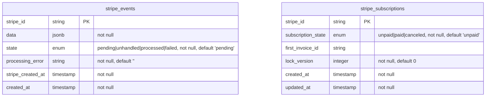

# StripeSubHub

Simple Stripe subscription management with three payment states: "unpaid," "paid," and "canceled."
- **Unpaid** is the default state of a subscription when created via Stripe.
- A subscription is considered **paid** when the first invoice is successfully paid.
- A paid subscription can be manually **canceled** in the app. A cancelation with a webhook event is unrestricted.

These states do not directly reflect the subscription's activity on Stripe during the processing phases. The focus is keeping the local record in sync and reflecting the state of unpaid, paid, and canceled.

## Data structure

Stripe events drive subscription updates. Optimistic locking prevents updates and stale subscriptions. 

## Setup

1.  Get the code.

        % git clone git@github.com:arkirchner/stripe_sub_hub.git

2.  Cope the env.sample to .env and add your Stripe secrets.

        % cp env.sample .env
        % vi .env

3.  Start or setup Rails.

        % bin/rails setup
        % bin/rails server

4.  Verify that the app is up and running.

        % open http://localhost:3000

## Stripe

The Stripe CLI is required for local testing. It is used to pip the webhook 
events to the local application.

1.  Connect the CLI to your Stripe test environment.

        % stripe login

2.  Forward subscription and invoice events to the local application. 

        % stripe listen --events customer.subscription.created,customer.subscription.deleted,invoice.paid \
                        --forward-to localhost:3000/webhooks/stripe_events

3.  You can create subscriptions with the [Stripe UI](https://dashboard.stripe.com/test/billing) or by manually triggering events.

##### Create an unpaid subscription.

        % stripe trigger customer.subscription.paused

##### Create a paid subscription.

        % stripe trigger customer.subscription.created

##### Create a canceled subscription.

        % stripe trigger customer.subscription.deleted

4.  Canceled subscriptions in the Rails console.

