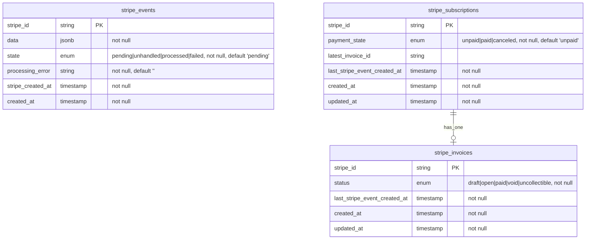

# StripeSubHub

Simple Stripe subscription management with three payment states:
"unpaid," "paid," and "canceled."

Unpaid is the default state of a subscription.

A subscription is considered paid when the latest invoice is paid. The paid 
status is different from the subscription's active state. A subscription is 
active during a long-running payment processing. 

The cancelation is recorded with the subscription state canceled. A canceled 
subscription automatically closes all invoices.

A paid subscription can be canceled in the app.

## Data structure

Stripe events drive the updates of the subscriptions and invoices. Event 
processing is restricted by the date the event was created. Only new events 
can update the resources (event created_at is compared with 
last_stripe_event_created_at).

## Setup

1.  Get the code.

        % git clone git@github.com:arkirchner/stripe_sub_hub.git

2.  Cope the env.sample to .env and add your Stripe endpoint secrets.

        % cp env.sample .env
        % vi .env

3.  Start or setup Rails.

        % bin/rails setup
        % bin/rails server

4.  Verify that the app is up and running.

        % open http://localhost:3000

## Stripe

The Stripe CLI is required for local testing. It is used to pip the webhook 
events to the local application.

1.  Connect the CLI to your Stripe test environment.

        % stripe login

2.  Forward subscription and invoice events to the local application. 

        % stripe listen --events customer.subscription.created,customer.subscription.updated,invoice.updated \
                        --forward-to localhost:3000/webhooks/stripe_events

3.  Create subscriptions on the Stripe UI .....

4.  Canceled subscriptions in the Rails console.

